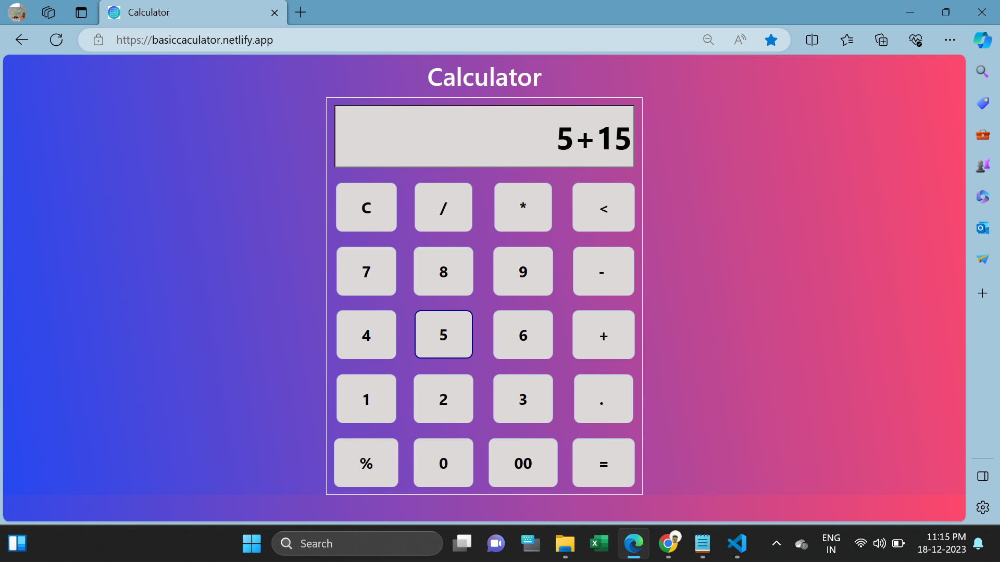
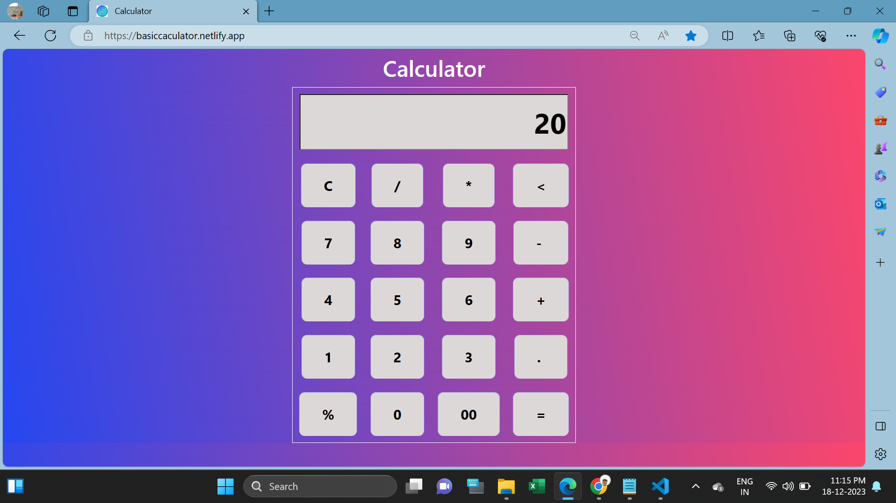

<h1>Calculator</h1>

This Calculator webpage used to perform Addition, Subtraction, Multiplication, Division and Modulas.

In this calculator includes clear button and back button.

I used HTML, CSS, Bootstrap and Javascript for developing this page.

I attached Webpage Screenshots in below:

<h2>Website URL</h2>
https://basiccaculator.netlify.app/

<h2>Screenshots</h2>

1. Its main web page

 

2. Typing an values

 

3. Result page

 
